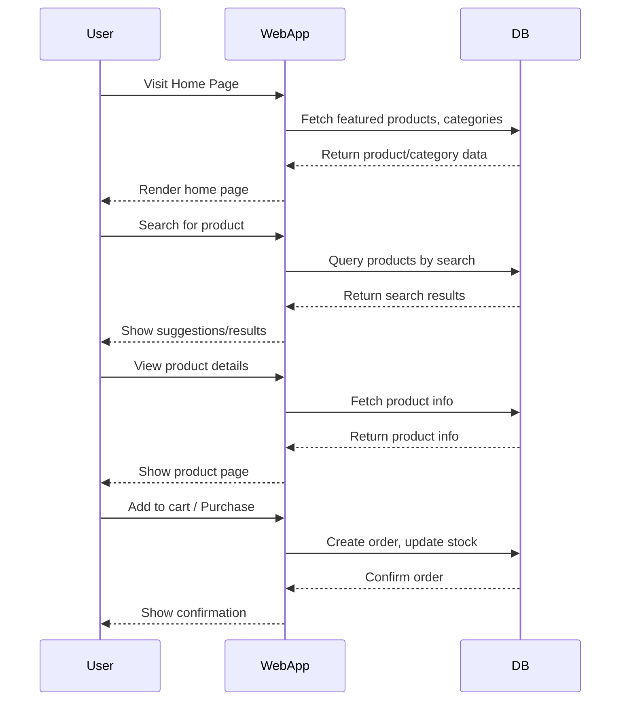

#MOBIL   

Welcome to **MOBIL  **, a modern   web application built with Symfony, Bootstrap 5, and Font Awesome.  
This project provides a robust foundation for online shopping, including user management, product categories, roles, and a visually appealing, responsive UI.

---

## Table of Contents

- [Features](#features)
- [Installation](#installation)
- [Usage](#usage)
- [Database Structure](#database-structure)
- [Sequence Diagram](#sequence-diagram)
- [Project Structure](#project-structure)
- [Customization](#customization)
- [Testing Plan](#testing-plan)
- [Contributing](#contributing)
- [License](#license)

---

## Features

- Responsive Bootstrap 5.3 design
- Font Awesome icons and animated backgrounds
- User authentication and roles
- Category and product management
- Admin dashboard with navigation
- Search with suggestions (AJAX-ready)
- Featured products section

---

## Installation

1. **Clone the repository:**
   ```sh
   git clone https://github.com/yourusername/ .git
   cd  
   ```

2. **Install PHP dependencies:**
   ```sh
   composer install
   ```

3. **Install Node dependencies (for assets):**
   ```sh
   npm install
   npm run dev
   ```

4. **Configure your `.env` file:**
   - Set your database credentials (e.g., `DATABASE_URL`).

5. **Create the database and run migrations:**
   ```sh
   php bin/console doctrine:database:create
   php bin/console doctrine:migrations:migrate
   ```

6. **Load fixtures (optional):**
   ```sh
   php bin/console doctrine:fixtures:load
   ```

7. **Run the Symfony server:**
   ```sh
   symfony server:start
   ```
   or
   ```sh
   php -S localhost:8000 -t public
   ```

---

## Usage

- Visit `http://localhost:8000` in your browser.
- Register or log in as an admin to access the dashboard.
- Manage categories, products, users, and roles from the admin panel.
- Use the search bar on the home page to find products.

---

## Database Structure

**Main Entities:**
- **User**: id, email, password, code, name, roles, role (relation to Role)
- **Role**: id, code, label, description, users (OneToMany)
- **Category**: id, code, label, description
- **Product/Item**: id, code, label, description, price, category (relation to Category), etc.

**Relationships:**
- User ↔ Role: ManyToOne (a user has one role, a role has many users)
- Product ↔ Category: ManyToOne (a product belongs to a category)

---

## Sequence Diagram

Below is a simplified sequence diagram for the "User purchases a product" flow:



---

## Project Structure

```
EcommerceSchoolProject/
├── assets/
├── migrations/
├── public/
├── src/
│   ├── Controller/
│   ├── Entity/
│   ├── Form/
│   └── Repository/
├── templates/
│   ├── base.html.twig
│   ├── home/
│   ├── category/
│   ├── user/
│   ├── role/
│   └── partials/
├── tests/
├── translations/
├── var/
├── vendor/
└── README.md
```

---

## Customization

- **Styling:** Edit `assets/styles/app.css` or use Bootstrap utility classes.
- **Icons:** Use any Font Awesome icon by changing the class in your Twig templates.
- **Entities:** Add or modify entities in `src/Entity/` and update with Doctrine migrations.

---

## Testing Plan

> **Note:** The UI uses [Bootstrap 5 CDN](https://getbootstrap.com/docs/5.3/getting-started/introduction/) for styling.

### Project Name:MOBIL    
**Document Version:** 1.0  
**Date:** June 9, 2025

### 1. Introduction
- **Purpose:** Define the strategy and scope for testing theMOBIL   web application, ensuring all critical features function as intended and meet quality standards.
- **Scope of Testing:** All major modules: user authentication, product/category management, admin dashboard, search, and the responsive UI.
- **Assumptions:** All requirements are documented and approved; test environment is similar to production.
- **Dependencies:** Symfony, Bootstrap 5 (via CDN), Font Awesome, MySQL, PHP, Node.js; test data available in the database.
- **Exclusions:** Third-party payment gateway integration (not implemented); mobile app (web only).

### 2. Test Items
- **Software Under Test:**MOBIL   Web Application (v1.0)
- **Modules/Features to be tested:**  
  - User Authentication & Roles  
  - Product & Category Management  
  - Admin Dashboard  
  - Search Functionality  
  - Footer & Navigation  
  - Responsive Design

### 3. Features to Be Tested
- Homepage accessibility and content
- User registration, login, and role assignment
- Category and product CRUD operations
- Admin dashboard navigation and controls
- Search bar with suggestions
- Footer links and social media icons
- Responsive layout on various devices

### 4. Features Not to Be Tested
- Payment processing (not implemented)
- Third-party integrations (not present)

### 5. Test Strategy/Approach
- **Levels of Testing:** Unit (PHPUnit), Integration (API/DB), System (end-to-end), UAT
- **Types of Testing:** Functional, Regression, Performance (basic), Security (auth/access)
- **Test Environment Strategy:** Local XAMPP server with PHP, MySQL, Node.js; Browsers: Chrome, Firefox, Edge
- **Test Data Strategy:** Use fixtures for users, categories, and products; manual data entry for edge cases
- **Entry Criteria:** All code changes merged to main branch; test environment set up and accessible
- **Exit Criteria:** All critical and major defects resolved; test cases executed with 95%+ pass rate
- **Suspension/Resumption:** Suspend if critical environment issues occur; resume after environment is restored

### 6. Roles and Responsibilities
- **Test Manager:** Oversees test planning and execution
- **Test Lead:** Coordinates test activities and reporting
- **Test Engineers:** Design and execute test cases
- **Developers:** Fix defects and support testing
- **Business Analysts:** Validate requirements and UAT

### 7. Test Deliverables
- Test Plan Document (this section)
- Test Cases/Scripts
- Test Data Sets
- Defect Reports
- Test Summary Reports

### 8. Test Schedule
| Phase                | Dates                  |
|----------------------|------------------------|
| Planning             | June 1 - June 3, 2025  |
| Test Case Design     | June 4 - June 6, 2025  |
| Test Execution       | June 7 - June 12, 2025 |
| Defect Management    | June 7 - June 13, 2025 |
| Reporting            | June 14, 2025          |

### 9. Test Environment
- **Hardware:** Windows PC, 8GB+ RAM, 2GHz+ CPU
- **Software:** Windows 10/11, XAMPP (PHP 8+), MySQL, Node.js, Composer, npm
- **Browsers:** Chrome, Firefox, Edge
- **Network:** Localhost or LAN

**Setup Steps:**
1. Install XAMPP, Node.js, Composer
2. Clone the repository and install dependencies
3. Configure environment variables and database
4. Run migrations and load fixtures
5. Start the local server

### 10. Tools
- **Test Management:** Manual (Excel/Markdown)
- **Defect Tracking:** GitHub Issues
- **Automation:** PHPUnit (backend), Cypress/Selenium (optional for UI)
- **Performance:** Browser DevTools

### 11. Risks and Mitigation
- **Risk 1:** Delays in environment setup  
  _Mitigation:_ Prepare setup guide and verify early
- **Risk 2:** Incomplete requirements  
  _Mitigation:_ Frequent communication with stakeholders
- **Risk 3:** Limited test data  
  _Mitigation:_ Use fixtures and manual data entry

### 12. Approvals

| Role               | Name             | Signature | Date       |
|--------------------|------------------|-----------|------------|
| Project Manager    | ________________ |           | __________ |
| Development Lead   | ________________ |           | __________ |
| Business Owner     | ________________ |           | __________ |
| Test Manager       | ________________ |           | __________ |

---

## Contributing

Pull requests are welcome! For major changes, please open an issue first to discuss what you would like to change.

---

## License

[MOBIL UNIVERSITY DOUALA](https://MOBIL.com/)

---